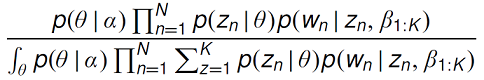
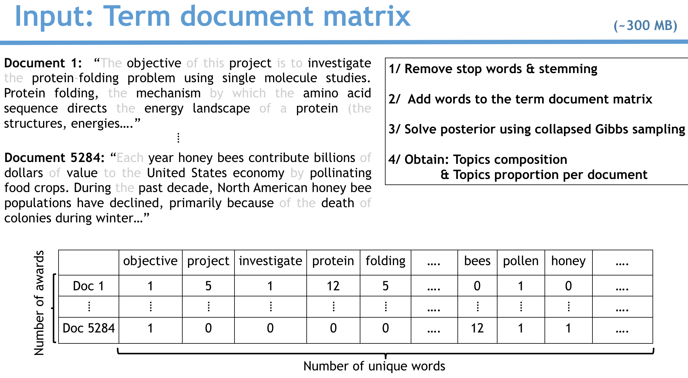
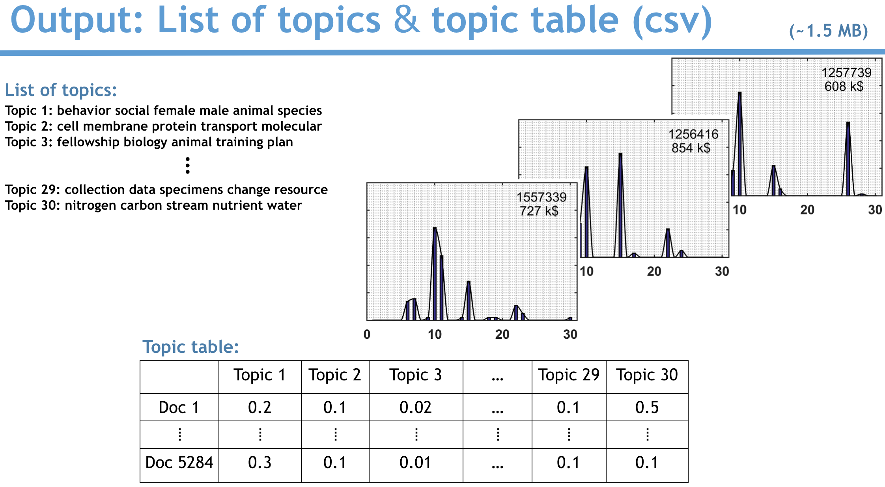
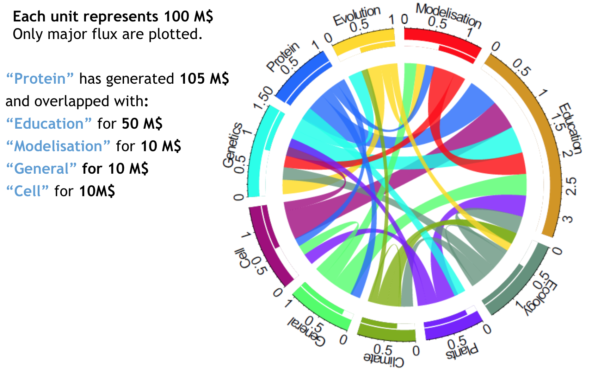

# Welcome to the ds4all github repo 

Welcome to the ds4all github repo. The easiest way to navigate it is on the associated dynamic website: [ds4all.io](http://54.234.234.146/). 

The repo is structured as follows:  
  ├── app  
  ├── supervised_learning  
  ├── pipeline  
  ├── README.md

**[app] Contains the source of the web app for Natural Language Quantification, therefore you can:**  
git clone https://github.com/clemriedel/ds4all  
cd ds4all/app  
python app.py  
Open your browser and go to 0.0.0.0:8000 to run it locally.

**Natural Language Quantification** permits to find patterns and quantify an amount generated by the patterns. An example is the money generated by topics in the National Science Foundation grants. NLQ can be applied to any activity described by words and quantified by numbers.

**Latent Dirichlet Allocation** --it takes few seconds to run the command line ([lda package](https://pypi.python.org/pypi/lda)); and a lifetime to master the power and flexibility of the algorithm. Blei, Ng and Jordan *(Journal of Machine Learning Research 3 (2003) 993-1022)* wrote the expression of the posterior:  

It might look daring; but thanks to the plate notation, it is really 
to understand. We solve it using Collapsed Gibbs sampling. 

It is important to understand what are the inputs and outputs of the algorithm.

I have analyzed more than 5000 NSF grants in the biological science department. That's an example [Award# 1122225](http://www.nsf.gov/awardsearch/showAward?AWD_ID=1122225&HistoricalAwards=false) where Susan Marqusee received 1.2 M$ to study single molecule protein folding. My words are the abstracts and my numbers the amount of money generated by the grant. You can upload any corpus of documents in a simple .csv; first column: numbers, second columns words (as they are, my algorithm ***Natural Language Quantification*** cleans, removes stop words and do the stemming on the fly).

***Input:*** The term document matrix. It is our observed variable, our Wd,n: each word added to the term document as follows:

We run lda and we solve the posterior. We draw zd,n: the per word topic assignement: it's the lists of topics); and Thetad the per-document topic proportion all the bart histograms for each doument:

***Output***

The topic table (Thetad) is a simple and small .csv (1.5 MB). I still feel impressed by how efficiently lda extracted the information and reduced the size  of the input (the term document matrix is of about 300 MB) by 200... With this topic table, we can.

